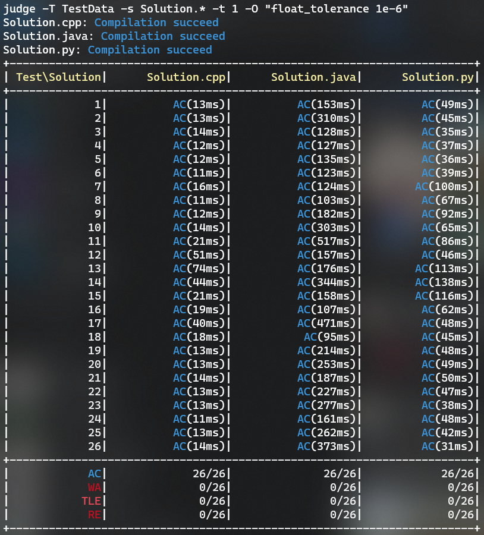

# Tool chấm offline cho Big-O Coding.


## 1. Cần cài thêm gì để xài:
- make
- g++
- java
- python3
- pypy3 (tùy chọn)

```
sudo apt update
sudo apt upgrade
sudo apt install make g++ default-jdk
```

Với **Windows** cần cài Ubuntu (app Ubuntu thôi chứ không phải nguyên cái hệ điều hành nha) trước rồi cài thêm mấy cái ở trên.

## 2. Cài judge tool

Download source code:

- Với version 1:
```
git clone https://github.com/baosws/bigo_judger
```

- Với version 2:
```
git clone https://github.com/nxphuc/bigo_judger
```

Sau đó thực hiện cài đặt:

```
cd bigo_judger
make
make install
```

## 3. Sử dụng

### 1. Đầu tiên di chuyển vào thư mục chứa sol các thứ (không cần cũng được, nhưng lát hồi sẽ phải nhập địa chỉ solution với test dài hơn).
**Ví dụ** cần chấm bài Advanced Fruits buổi 11  của Orange ở *Dropbox/TA Big-O Orange/BigO_Orange_Lecture11_DP_LCS (Part II)/4. Advanced Fruits - SPOJ (BTVN Bai 1)*
- Ubuntu:
```
cd ~/"Dropbox/TA Big-O Orange/BigO_Orange_Lecture11_DP_LCS (Part II)/4. Advanced Fruits - SPOJ (BTVN Bai 1)"
```
- Windows: Dropbox nằm ở */mnt/c/Users/<tên User>/Dropbox* nên phải thêm cái đó vào đầu:
```
cd "/mnt/c/Users/Bao/Dropbox/TA Big-O Orange/BigO_Orange_Lecture11_DP_LCS (Part II)/4. Advanced Fruits - SPOJ (BTVN Bai 1)"
```

### 2. Chấm thôi! Bước này tùy điều kiện mà làm khác nhau.
Trong folder này có 4 solution là  *Solution_AC.cpp, Solution_AC.java, Solution_AC.py, Solution_RE.cpp*. Thư mục test tên là *data* (mặc định các cặp input, answer có đuôi là *.in* và *.ans*). Checker tên là *checker.cpp*:

- Chấm *Solution_AC.cpp*:
```
judge Solution_AC.cpp -T data
```


**Note**: Nếu thư mục test data đặt là *TestData* rồi thì không cần *-T TestData* nữa vì đó là tên test mặc định.


- Chấm cả 4 sol trên:
```
judge Solution_AC.cpp Solution_AC.java Solution_AC.py Solution_RE.cpp -T data
```
hoặc
```
judge Solution* -T data
```


- Hiện lỗi compilation error: **-c**
```
judge Solution* -T data -c
```


- Hiện lỗi runtime error: **-r**
```
judge Solution* -T data -r
```


- Hiện chỗ sai của output so với answer/checker: **-d**
```
judge Solution* -T data -d
```


- Chấm thêm time limit 0.01s: **-t <time tính bằng s>**
```
judge Solution.* -T data -t 0.01
```


- Chấm với checker mặc định và option

Đối với checker mặc định, có 5 option có thể sử dụng (xem chi tiết mục 4). Ví dụ cần chạy so sánh với sai số không vượt quá $10^{-6}$:

```
judge -T TestData -s Solution.* -t 1 -O "float_tolerance 1e-6"
```


- Chấm với checker: **-C <tên checker>**
```
judge Solution.* -T data -C checker.cpp
```


**Note**: checker không nhất thiết phải là C++ nhưng phải theo chuẩn template của anh Phút (coi trong *Cẩm nang trợ giảng*).

## 4. Các option nhảm nhí khác:

Có thể coi help bằng:

```
judge -h
```

| Option | Ý nghĩa |
|--------|---------|
|-I input\_extention| Nếu input không có đuôi mặc định là *.in* thì thêm cái này. Ví dụ '-I inp' |
|-A answer\_extension| Nếu answer không có đuôi mặc định là *.ans* thì thêm cái này. Ví dụ '-A out' |
|-O options | Option cho checker. Nếu là custom checker thì tùy mình quy định ứng với code checker. Nếu sử dụng checker mặc định, sẽ có các tham số sau: <br> <ul> <li><i>case_sensitive</i>: phân biệt hoa thường</li> <li><i>space_change_sensitive</i>: kiểm tra chính xác số lượng khoảng trắng giữa các pattern</li> <li><i>float_absolute_tolerance x</i>: so sánh số thực với sai số tuyệt đối cho phép là x: $\lvert team - judge \rvert \leq x$</li> <li><i>float_relative_tolerance x</i>: so sánh số thực với sai số tương đối cho phép là x: $\frac{\lvert team - judge \rvert}{judge} \leq x$</li> <li><i>float_tolerance x</i>: so sánh số thực với sai số tuyệt đối và tuyệt đối, chỉ cần 1 điều kiện thỏa mãn là được </li></ul> Ví dụ: *-O \"case_sensitive float_tolerance 1e-6\"* sẽ chấm số thực với sai số cho phép là 1e-6 và kiểm tra phân biệt hoa thường |
|-p path | Set thư mục làm việc (nhưng chắc không ai xài cái này đâu) |
|-P| Chỉ định chạy file python bằng pypy3 |

## 5. TODO

- Cho phép chấm interactive problem